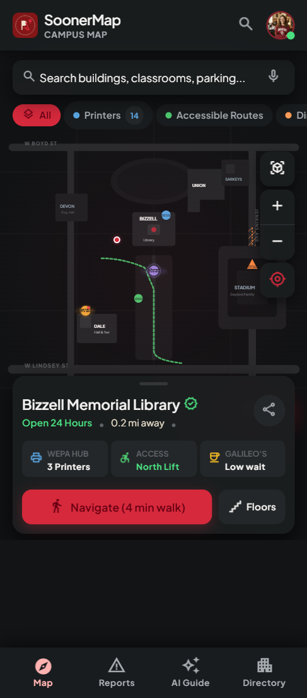
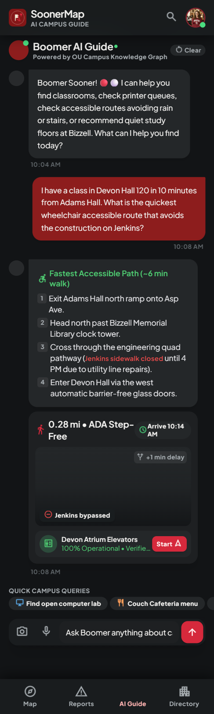
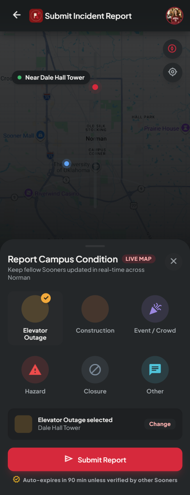
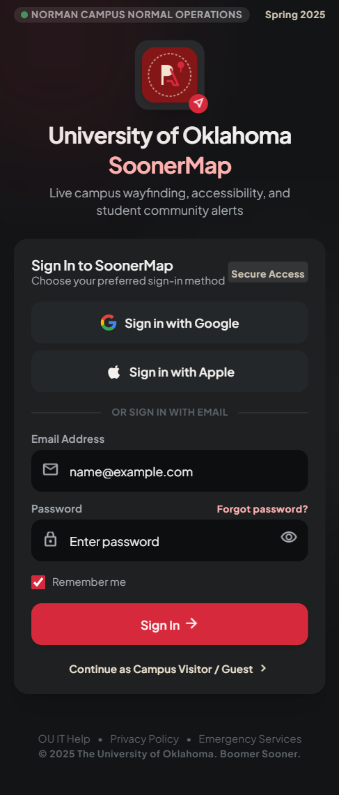

# OU Campus Navigation Map

A cross-platform (iOS and Android) mobile app for navigating the University of Oklahoma's Norman campus. It is built primarily for students, with visitors, parents, and campus staff as secondary audiences, and answers questions that a paper map or the official campus website can't:

- Where is this building, and how long will it take me to walk there?
- Which entrance is accessible, and does the building have a working elevator right now?
- Where is the nearest WEPA printer, or somewhere to eat?
- Is anything happening on campus right now, such as construction, closures, a broken elevator, or an event blocking a walkway?

Two things set it apart from OU's existing static map:

1. **Crowdsourced, time-limited reports.** Signed-in users can submit categorized reports (elevator outage, construction, event, hazard, closure) that appear on the map for everyone, can be upvoted or downvoted, and expire automatically.
2. **A natural-language campus assistant.** Users can ask questions in plain English and get answers grounded in the app's own live data, instead of tapping through menus.

The app covers the Norman campus only. It gives walking routes with distance and estimated walk time, but not indoor turn-by-turn navigation.

## Team — Group B

- Andy Henson
- Dorothy Yoon
- Tyler Stageberg
- Nathan Sandoval
- Will Aclin

## Course

CS-3203-001, Fall 2026

## Features

- Interactive campus map with building and room locations
- Campus/building data collection and integration
- Accessibility mapping (ramps, elevators, door buttons)
- Walking navigation with walk time calculations
- AI navigation assistant connected to the map
- Traffic/issue/event/maintenance reporting
- Staff reporting dashboard

## Screenshots

Design mockups for the main screens. The app is being built to match these; see [`docs/design/design-system.md`](docs/design/design-system.md) for the full design system.

| Campus map                                                            | AI guide                                                       | Report a condition                                                     | Sign in                                                        |
| --------------------------------------------------------------------- | -------------------------------------------------------------- | ---------------------------------------------------------------------- | -------------------------------------------------------------- |
|  |  |  |  |

## Tech Stack

| Layer              | Technology                                                                                                        |
| ------------------ | ----------------------------------------------------------------------------------------------------------------- |
| Mobile app         | React Native + Expo (Expo Router for file-based navigation), TypeScript                                           |
| Map rendering      | `react-native-maps`                                                                                               |
| Walking directions | Mapbox Directions API (walking profile)                                                                           |
| Data fetching      | TanStack Query (React Query)                                                                                      |
| Database           | Supabase (PostgreSQL + PostGIS), with Row Level Security                                                          |
| Auth & realtime    | Supabase Auth (email + password) and Supabase Realtime for live report updates                                    |
| Backend API        | Node.js 20+, Express, TypeScript, Zod for request validation                                                      |
| AI service         | Python 3.11+, FastAPI, Pydantic, OpenAI API (retrieval-augmented assistant and report classification)             |
| Testing & tooling  | Jest and Testing Library (mobile), Vitest and Supertest (API), pytest (AI service), ESLint, Prettier, Ruff, Black |
| Repo structure     | npm workspaces monorepo (`apps/mobile`, `apps/api`, `apps/ai-service`, `packages/shared-types`)                   |

## Documentation

| Document                                                       | What's in it                                                                      |
| -------------------------------------------------------------- | --------------------------------------------------------------------------------- |
| [`docs/design-doc.md`](docs/design-doc.md)                     | Full spec: scope tiers, architecture, data model, API, phases, definition of done |
| [`docs/design/design-system.md`](docs/design/design-system.md) | UI tokens, components, and screen designs                                         |
| [`apps/mobile/README.md`](apps/mobile/README.md)               | Mobile app layout and conventions                                                 |
| [`apps/api/README.md`](apps/api/README.md)                     | Node API endpoints, auth, rate limits                                             |
| [`apps/ai-service/README.md`](apps/ai-service/README.md)       | AI assistant endpoints and how answers stay grounded                              |
| [`supabase/seed/README.md`](supabase/seed/README.md)           | Where campus data comes from and how to edit it                                   |

## Getting Started

### Prerequisites

| Tool                                                              | Needed for                                |
| ----------------------------------------------------------------- | ----------------------------------------- |
| [Node.js 20+](https://nodejs.org/) and npm                        | Everything (mobile app, API, tooling)     |
| [Git](https://git-scm.com/)                                       | Cloning and contributing                  |
| [Expo Go](https://expo.dev/go) on your iOS or Android phone       | Running the app on a device               |
| [Docker Desktop](https://www.docker.com/products/docker-desktop/) | Local Supabase database (full stack only) |
| [Python 3.11+](https://www.python.org/)                           | AI service (full stack only)              |

The Supabase CLI is installed by `npm install` (it's a dev dependency), so you don't need to install it separately.

### Option A: Quick start (demo mode, about 5 minutes)

The app can run with **no backend at all**. With the Supabase variables left blank, it reads bundled seed data and shows a "Demo mode" banner. Accounts and reports are disabled in this mode.

```bash
git clone https://github.com/NathanSando/OUCampusMap.git
cd OUCampusMap
npm install
cp apps/mobile/.env.example apps/mobile/.env
npm run mobile
```

Scan the QR code in the terminal with Expo Go (Android) or the Camera app (iOS). Your phone and computer must be on the same Wi-Fi network.

### Option B: Full stack (database + API + AI service)

Run each service in its own terminal, from the repo root unless noted.

**1. Database (local Supabase in Docker)**

```bash
npm run db:start   # prints the API URL, anon key, and service_role key; keep these
npm run db:reset   # applies supabase/migrations and loads the seed data
```

**2. Node API.** Copy [`apps/api/.env.example`](apps/api/.env.example) to `apps/api/.env` and fill in `SUPABASE_URL`, `SUPABASE_SERVICE_ROLE_KEY`, and any random string for `AI_SERVICE_SHARED_SECRET`.

```bash
npm run api        # check http://localhost:3000/api/health
```

**3. AI service.** Copy [`apps/ai-service/.env.example`](apps/ai-service/.env.example) to `apps/ai-service/.env` and fill in `OPENAI_API_KEY`, the same Supabase values, and the **same** shared secret you used for the API.

```bash
cd apps/ai-service
py -3.11 -m venv .venv          # macOS/Linux: python3 -m venv .venv
.venv\Scripts\activate          # macOS/Linux: source .venv/bin/activate
pip install -r requirements-dev.txt
uvicorn app.main:app --reload --port 8000
```

**4. Mobile app.** In `apps/mobile/.env`, set `EXPO_PUBLIC_SUPABASE_URL` and `EXPO_PUBLIC_SUPABASE_ANON_KEY` from step 1 and `EXPO_PUBLIC_API_BASE_URL` (for example `http://192.168.1.20:3000`). Optionally set `EXPO_PUBLIC_MAPBOX_PUBLIC_TOKEN` to a public `pk.*` token; without it, directions fall back to a labelled straight-line estimate.

```bash
npm run mobile
```

> On a physical phone, use your computer's **LAN IP address** instead of `localhost` or `127.0.0.1` in the mobile `.env`.

**Never commit `.env` files.** Service-role keys and the OpenAI key stay server-side. The mobile app only ever gets public keys.

### Common commands

| Command                        | What it does                                                       |
| ------------------------------ | ------------------------------------------------------------------ |
| `npm run mobile`               | Start the Expo dev server (port 8095)                              |
| `npm run api`                  | Start the Node API with hot reload (port 3000)                     |
| `npm run ai`                   | Start the AI service on port 8000 (uses the Windows `py` launcher) |
| `npm run db:start` / `db:stop` | Start or stop local Supabase                                       |
| `npm run db:reset`             | Regenerate seed files from CSVs and rebuild the local database     |
| `npm run seed:generate`        | Regenerate seed files after editing `supabase/seed/data/*.csv`     |
| `npm run lint`                 | ESLint across the TypeScript workspaces                            |
| `npm run typecheck`            | TypeScript type check                                              |
| `npm test`                     | Jest (mobile), Vitest (API), and shared-types tests                |
| `npm run format`               | Format everything with Prettier                                    |

For the AI service, run `pytest -q && ruff check . && black --check .` inside `apps/ai-service`.

## Contributing

### Branching Strategy

We use a three-tier branching model to keep `main` stable and avoid conflicts between team members:

- **`main`**: always deployable. Only updated through reviewed pull requests.
- **`dev`**: integration branch. Finished features are merged here first and tested together.
- **Task branches**: one per task, created off `dev`, with a prefix that matches the kind of change:
  - `feat/` new functionality, e.g. `feat/accessibility-mapping`, `feat/walk-time-calculation`
  - `fix/` bug fixes, e.g. `fix/marker-offset`
  - `docs/` documentation only, e.g. `docs/setup-guide`
  - `chore/` tooling, config, or dependencies, e.g. `chore/monorepo-setup`

### Workflow

1. Pick a task from the current sprint and make sure it is assigned to you.
2. Create a branch off `dev`:
   ```bash
   git checkout dev
   git pull
   git checkout -b feat/your-feature-name
   ```
3. Commit in small, frequent commits using [conventional commit](https://www.conventionalcommits.org/) prefixes: `feat:`, `fix:`, `docs:`, `chore:`, `test:`.
4. Before opening a PR, run the same checks CI runs:
   ```bash
   npm run format:check && npm run lint && npm run typecheck && npm test
   ```
   If you edited a CSV in `supabase/seed/data/`, run `npm run seed:generate` and commit the regenerated files too.
5. Squash your work into clean commits (`git rebase -i HEAD~n`, where n is the number of commits), then rebase onto the latest `dev`:
   ```bash
   git fetch origin
   git rebase origin/dev
   ```
6. Push your branch and open a Pull Request into `dev`. Say what changed, name the task it completes, and include a screenshot for UI changes.
7. At least **one teammate must approve** the PR, and CI ([`.github/workflows/ci.yml`](.github/workflows/ci.yml)) must pass before merging.
8. Once a stable set of features works together on `dev`, `dev` is merged into `main`.

### Why this workflow?

- **Branching** isolates each person's work (e.g. Andy and Nathan on accessibility mapping, Tyler on the map prototype) so no one breaks `main` while experimenting.
- **Squashing** keeps the commit history readable: one commit is one change, not a dozen "wip" commits.
- **Rebasing** avoids messy merge commits and keeps a linear, easy-to-follow history.
- **Pull requests** make sure every change is reviewed and tested before it reaches a shared branch.

### Code conventions

- TypeScript is formatted with Prettier and linted with ESLint. Python is formatted with Black and linted with Ruff. CI enforces both.
- Types shared by the app and the API live in `packages/shared-types`. Change them there, not in each app.
- Campus data is edited in the CSVs under `supabase/seed/data/`, never in the generated `seed.sql` or `seed.generated.json`.
- App-specific rules (colors from `theme.ts`, accessibility labels, loading/empty/error states) are in [`apps/mobile/README.md`](apps/mobile/README.md).

## Project Structure

```
OUCampusMap/
├── apps/
│   ├── mobile/              # Expo / React Native app (iOS + Android)
│   │   ├── app/             #   Expo Router screens: map, reports, AI guide, profile, auth
│   │   └── src/             #   components, hooks, lib (Supabase/API/Mapbox clients), theme
│   ├── api/                 # Node + Express + TypeScript API (report writes, voting, AI proxy)
│   │   ├── src/             #   routes, middleware, services, Zod schemas
│   │   └── test/            #   Vitest + Supertest
│   └── ai-service/          # Python + FastAPI campus assistant and report classifier
│       ├── app/             #   retrieval, prompts, classification, LLM client
│       └── tests/           #   pytest
├── packages/
│   └── shared-types/        # TypeScript types shared by mobile and API
├── supabase/
│   ├── migrations/          # SQL schema, Row Level Security, read views
│   └── seed/                # campus data CSVs + generator script
├── docs/                    # design doc, design system, mockups
├── .github/workflows/ci.yml # format, lint, typecheck, and tests on every PR
└── package.json             # npm workspaces root and shared scripts
```
